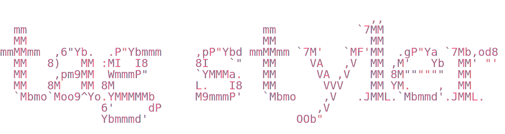

# Tag Styler

        

  

Customize the appearance of tags in your Obsidian vault. Set text color, background color (with opacity control), and font size for individual tags.

## Features

- Automatically discovers all tags in your vault
- Set text color, background color, and font size per tag
- Full opacity/alpha control via slider (supports `#RRGGBBAA` colors)
- Live preview of tag styles in settings
- Works in both Reading View and Live Preview (editor)
- Styles tags in frontmatter, inline, and nested tags
- Tags with no customization are automatically cleaned up
- Remove button for orphaned tag styles (tag no longer in vault)

## Installation

### From Obsidian Community Plugins

**Might not be approved yet**

1. Open **Settings** > **Community Plugins**
2. Search for **Tag Styler**
3. Click **Install**, then **Enable**

### Manual Installation

1. Download `main.js`, `manifest.json`, and `styles.css` from the [latest release](../../releases/latest)
2. Create a folder called `tag-styler` in your vault's `.obsidian/plugins/` directory
3. Copy the downloaded files into that folder
4. Restart Obsidian and enable the plugin in **Settings** > **Community Plugins**

## Usage

1. Open **Settings** > **Tag Styler**
2. All tags from your vault are listed automatically
3. Click **Edit** on any tag to expand its controls
4. Use the color picker to set text and background colors
    - Click the swatch to open the native color picker
    - Type a color value directly (`#RRGGBB`, `#RRGGBBAA`, `rgb()`, `rgba()`)
    - Use the opacity slider to adjust transparency
    - Click the X button to clear the color
5. Set a custom font size (e.g. `14px`, `1.2em`, or just `14` for pixels)
6. Changes apply immediately -- no restart needed

## Color Formats

The color picker supports the following formats:

- `#RRGGBB` -- standard hex (e.g. `#ff6188`)
- `#RRGGBBAA` -- hex with alpha (e.g. `#ff618880`)
- `rgb(r, g, b)` -- RGB values 0-255
- `rgba(r, g, b, a)` -- RGBA with alpha 0-1

The opacity slider provides a visual way to adjust the alpha channel from 0% to 100%.

## License

[MIT](LICENSE)
